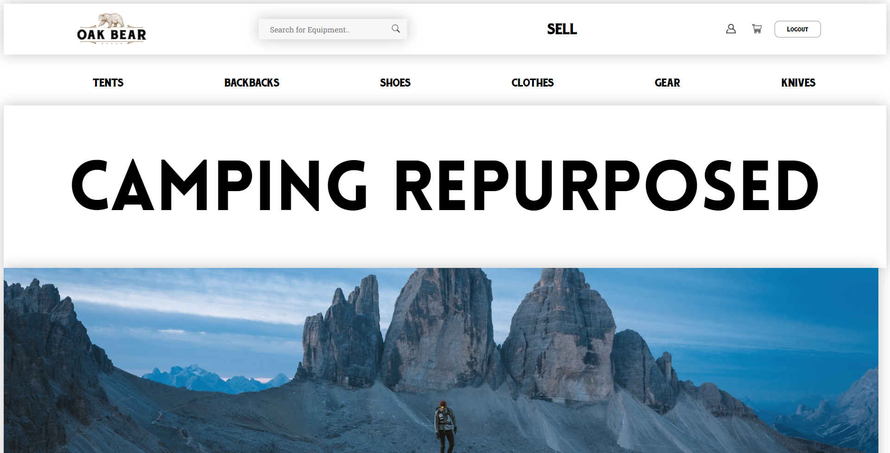
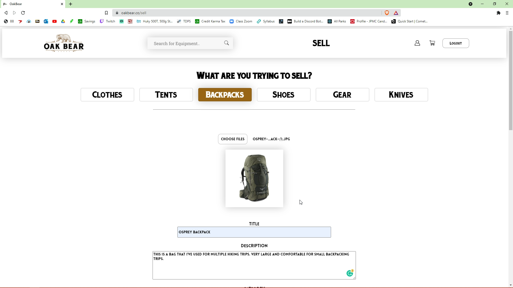
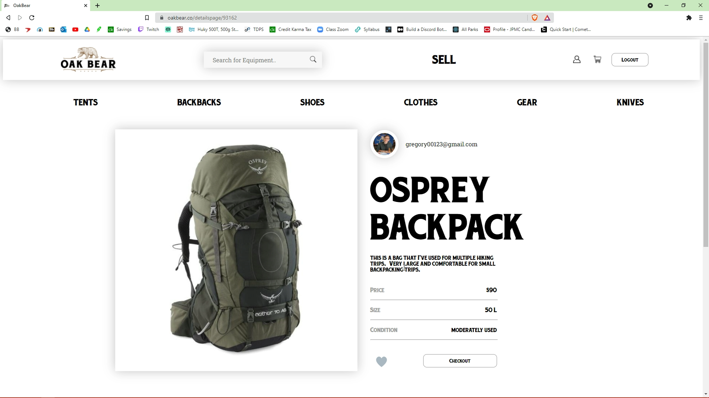
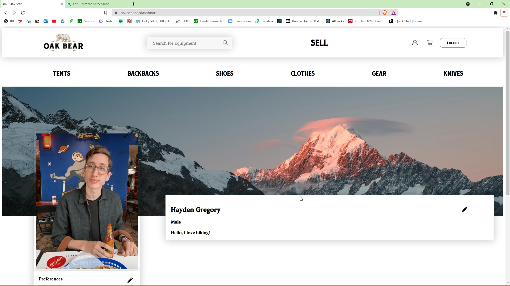

# OakBear

#### Site hosted through Heroku + GoDaddy: https://www.oakbear.co

Oakbear is an online marketplace specifically tailored to the outdoors. Users can sell their used camping/hiking gear, from tents to flashlights, or just buy at great prices. The site is built on Express, using the React/Redux framework with data stored in MongoDB.

## Sell Gear
After your set up an account with Stripe, the payment platform we are using, you will be eligible to post your used outdoor products. Choose a picture, write a description, set a price, and your item will be posted immediately. 

## Buy Gear
Find lightly used products for sale at great prices. Buyers and sellers can talk directly with each other without a middle-man.

## Dashboard
Keep track of your favorited, sold, and purchased items. Introduce yourself to others by adding a bio, prefrences and a profile picture.
 

## Tech Stack

- Front-end: 
        

- Back-end: 
     

## Database

## MVP
- Front-end - React
- Database - MongoDB / Mongoose
- Backend - Node.js
- Recorded Demo
- Hosted through GoDaddy
- Protect with SSL certificate

## Stretch Goals (Future)
- Make mobile-responsive
- Messaging feature between buyer/seller